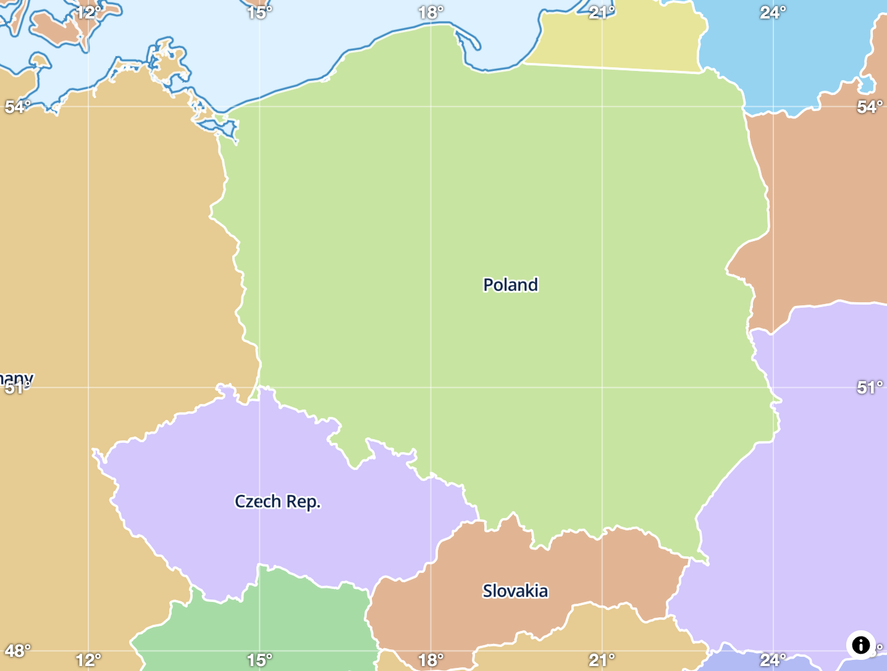

# GeoGrid for MapLibre GL  

**GeoGrid** is a MapLibre GL JS plugin for adding a highly customizable geographic grid to your map.  

  

## Features  

- **Display Geographic Grid**: Adds a grid with labeled coordinates to the map.
- **Customizable Grid Density**: Adjust grid density dynamically based on zoom level.
- **Zoom Level Visibility Range**: Control grid visibility with the `zoomLevelRange` option.
- **Custom Label Formats**: Change the label format to suit your needs. Default format:  
  ```[degrees]° [minutes]’ [seconds]’’```
- **CSS Label Styling**: Easily style labels using CSS (e.g., text shadows, blending modes).
- **Flexible Grid Styling**: Modify grid line color and width via the API.
- **Layer Placement Control**: Place grid lines under any existing map layer using `beforeLayerId`.
- **Dynamic Label Visibility**: Labels automatically hide when the map is rotated away from north.
- **Optimized Performance**: Only elements visible in the viewport are rendered, ensuring no performance impact.
- **Easy Removal**: Remove the grid programmatically using the `remove()` method.  
- **TypeScript Support**: Includes TypeScript definitions for better development experience.
- **ES Module Ready**: Available as a JavaScript module for modern workflows.


## Installation

Get it from NPM:

```bash
npm i geogrid-maplibre-gl
```

Or use it from the CDN:

```html
<script type="module" src="https://unpkg.com/geogrid-maplibre-gl@latest"></script>
<link href="https://unpkg.com/geogrid-maplibre-gl@latest/dist/geogrid.css" rel="stylesheet" />
```

## Usage

### Minimal example

```js
import { GeoGrid } from 'geogrid-maplibre-gl';
// Import css from 'geogrid-maplibre-gl/dist/geogrid.css'

// const map = new maplibregl.Map(...);

new GeoGrid({ map });
```

### All options

```js
import { GeoGrid } from 'geogrid-maplibre-gl';

// const map = new maplibregl.Map(...);

new GeoGrid({ 
    map,
    beforeLayerId: 'labels'
    style: {
        color: 'rgba(255, 255, 255, 0.5)'
        width: 2
    },
    zoomLevelRange: [0, 13],
    gridDensity: (zoomLevel) => 10;
    formatLabels: (degreesFloat) => Math.floor(degreesFloat);
});
```

Programatically removing and re-adding:

```js
const geogrid = new GeoGrid({ map });

// On some event
geogrid.remove();

// On another event
geogrid.add();
```

## Styling

Customize the appearance of the grid labels by overriding the following CSS classes:
* `geogrid` - The main container for labels.
* `geogrid__label` - Invidual label elements.
* `geogrid__label--left` - Labels on the left.
* `geogrid__label--right` - Labels on the right.
* `geogrid__label--top` - Labels on the top.
* `geogrid__label--bottom` - Labels on the bottom.

To prevent overriding default properties, nest overrides inside `.geogrid-overrides` selector.

For example:
```css
.geogrid-overrides .geogrid__label {
    color: red
}
```
